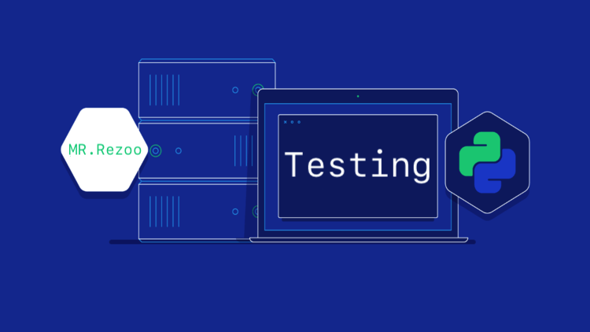

# Python-Testing



Hello this is [Mr.Rezoo](https://www.linkedin.com/in/reza-mobaraki/)

## Table of contents

* [General info](#General-info)
* [Technologies](#Technologies)
* [Help](#Help)
* [Setup](#Setup)
* [Usage](#Usage)
* [Credits](#credits)
* [Contributors](#Contributors)
* [License](#license)

## General info

in this repository We work on 4 way to testing our application In the simplest
possible way. . .

* unittest
* pytest
* doctest
* nose


## Technologies

Project is created with:

* Python: 3.9
* nose: 1.3.7
* pytest: 6.2.4

## Help

If you are considering a particular method, more modern technology Add to my
project and send merge request, I will add you in the credits and contributors
section

## Setup

* first step : create virtual environment

```shell
virtualenv -p python3 venv 
```

* second step : activate virtual environment

```shell
source venv/bin/activate  
```

* third step : install package | library from requirements.txt

```shell
 pip install -r requirements.txt
```

* fourth step : install package | library from requirements.txt

```shell
 pip install -r requirements.txt
```
* last step : go to tests directory if you want to run test
```shell
 cd tests
```

## Usage

* run doctest: -v for more detail

```shell
python -m doctest -v filename.py
```

* run unittests:

```shell
python -m unittest -v test_file.py
```

* run all unittests:

```shell
python -m unittest -v discover
```

* run all tests with nose test:

```shell
nosetests
```

* run one test with nosetest:

```shell
nosetests -v test_file.py
```

* run all tests with pytest:

```shell
pytest
```

* run one test with pytest:

```shell
pytest -v test_file.py
```

## Credits

* [mongard](https://www.mongard.ir/courses/unittest)

## Contributors

* [MrRezoo](https://github.com/MrRezoo)

## License

Distributed under the MIT License. See [license](LICENSE) for more information.